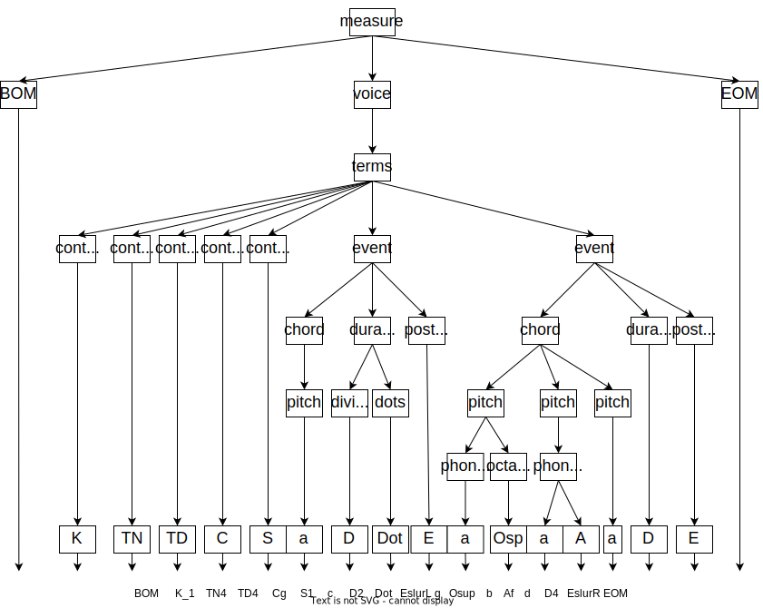

# PARAFF

**PARAFF** is a sheet music domian-specific language, designed for algorithmic musical composition.


## Hello World

Paraff code:

```paraff
BOM K0 TN4 TD4 S1 Cg c D1 EOM
```

Lilypond code:

```lilypond
\relative c' {
	\key c \major \time 4/4 \clef "treble" c1
}
```

Sheet music:


## A Complex Sample

```paraff
BOM K4 TN3 TD8 S1 Cg Mu f As Osup D32 Bl d As D32 b D32 g As D32 Br S2 f As Osub D32 Bl d As D32 f As D32 g As D32 Br S1 Md d As Osup D32 Bl S2 Mu g As Osub D32 S1 Md b D32 d As D32 Br VB
S2 Cf b D8 Bl S1 d As Osup D8 EslurL f As D8 Br EslurR VB
S2 Cf Md b Osub d As D8 Bl b D8 b D8 Br EOM
```

```lilypond
\score {
	\new GrandStaff <<
		\new Staff = "1" << \MergeHD
			\new Voice \relative c' { \key e \major \time 3/8 \ottava #0 \clef "treble" \stemUp fs'32 [ ds32 b32 gs32 ] \change Staff = "2" fs,32 [ ds32 fs32 gs32 ] \change Staff = "1" \stemDown ds'32 [ \change Staff = "2" \stemUp gs,32 \change Staff = "1" \stemDown b32 ds32 ]  }
		>>

		\new Staff = "2" << \MergeHD
			\new Voice \relative c' { \key e \major \time 3/8 \ottava #0 \clef "bass" b8 [ \change Staff = "1" ds'8 ( fs8 ] )  }

			\new Voice \relative c' { \key e \major \time 3/8 \ottava #0 \clef "bass" \stemDown <b, ds>8 [ b8 b8 ]  }
		>>
	>>

	\layout {
	}
	\midi {\tempo 4 = 100}
}
```


## Grammar Tree




## Language Features

* Friendly for tokenizers

	Paraff vocabulary made up by a group of pure alphabet-number words.
	A paraff sentence is a sequence of words, separated by space.

	The total number of paraff tokens is less than 256.
	So music scores in paraff format can be serialized as a uint8 byte array.

* Convertable from/to Lilypond

	[Lilypond](https://lilypond.org/) is a strong expressive music language, whose engraving program with comprehensive functionaliy.
	Paraff is designed refering to Lilypond,
	whose context dependent grammars were simplified,
	and scope symbols were removed.

	Paraff score can be losslessly converted into Lilypond.
	Most regular Lilypond scores can be converted into Paraff. However, there are some restriction in grammar usage for complex scores.

* Parseable into JSON

	Paraff is not only a music tokenization solution, as a language,
	it also has a grammar interpreter by [JISON](https://github.com/zaach/jison).

	The Paraff grammar file is [here](source/paraff/paraff.jison).
	If you are familiar with BISON/JISON, you can test the grammar parsing by [Jison debugger](https://nolanlawson.github.io/jison-debugger/).


## Usage

### Convert a paraff source file to Lilypond

```sh
yarn ts ./tools/paraffToLilypond.ts paraff-source-file.yaml path-to-target-dir
```

### Binary Paraff converting

```sh
yarn ts ./tools/paraffTokenizer.ts paraff-source-file.yaml
```

---
The Paraff document with more details is coming soon.
